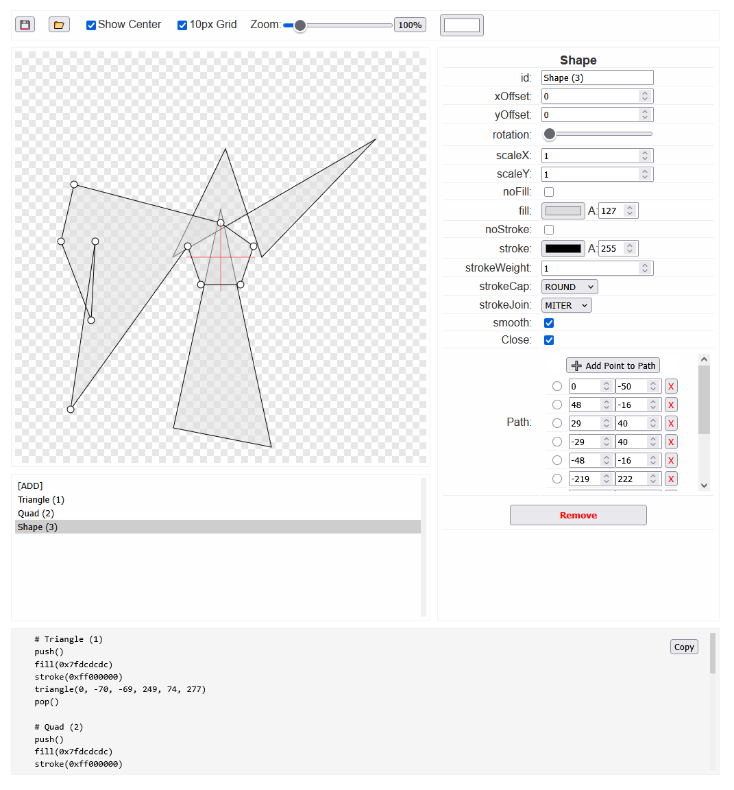

# P5paint - Visual Shape Editor for Processing Python Mode

A visual design tool that helps create complex shapes and graphics for Processing Python Mode applications by providing a real-time code generator.

- [Try P5paint Online](https://p5paint.example.com) 
- [GitHub Repository](https://github.com/yourusername/P5paint)
- [License](LICENSE)

## Purpose

Creating precise shapes and graphics in Processing through code alone can be time-consuming due to the iterative nature of adjusting coordinates and properties. P5paint solves this by providing:

- Visual drawing interface for precise shape creation
- Real-time Processing Python Mode code generation
- Interactive anchor point editing
- Property controls for fine-tuning shapes
- Project save/load functionality

## Features

- **Supported Shapes:**
  - Rectangle
  - Triangle
  - Ellipse
  - Arc
  - Circle
  - Line
  - Point
  - Quad
  - Square
  - Custom Shapes (vertex-based)

- **Shape Properties:**
  - Position/Translation
  - Rotation
  - Scale
  - Fill color with alpha
  - Stroke color with alpha
  - Stroke weight
  - Stroke cap/join styles

- **Interface:**
  - Zoom controls
  - Grid display
  - Center point reference
  - Background color selection
  - Code copy button
  - Project save/load (.json)

## Usage

1. Select a shape type from the properties panel
2. Adjust shape properties using the controls
3. Fine-tune positions using anchor points
4. Copy the generated code from the code panel
5. Paste the code into your Processing Python Mode project

## Target Audience

- Processing developers
- Game developers
- Digital artists
- Creative coders
- Anyone needing precise shape creation for Processing

## Current Limitations

Some Processing shape types are not yet implemented:
- Curves
- Bezier curves
- Additional shape types may be added in future updates

## File Format

Projects can be saved and loaded using the JSON format (.json)
